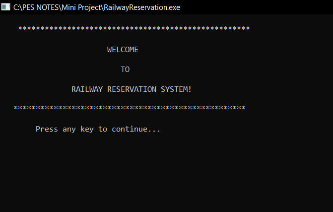

# Simple-Railway-Reservation-System-using-C
This is a mini-project submitted for the course "Problem Solving with C" offered by PES University.

Welcome Screen

Login Page

Main Menu

List of Trains

